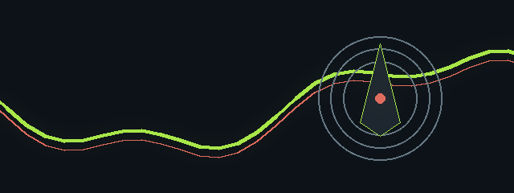

  

<h1 align="center">weatherify</h1>

<strong>A single-page, client-side weather web app (branded in sources as WeatherWise / Weatherify) composed of index.html, style.css and script.js. The repository snapshot is incomplete and contains at least one JavaScript syntax error that prevents the app from running as-is.</strong>

<code>REPO//SIGNAL</code> · <code>SIGNAL / PRODUCT</code> · <code>LOOPING README EXPERIENCE</code>

## Live signal

| Lens | Readout |
| --- | --- |
| Portfolio lane | **SIGNAL / PRODUCT** |
| Code surface | **5** tracked files observed |
| Primary materials | **Markdown, HTML, JavaScript, CSS** |
| Verification | **0** test-related files observed |

> A moving scan of the project surface. The animated frame above is a lightweight visual signature; the sections below remain the source of truth for implementation details.

## Motion map

`SIGNAL` → `SHAPE` → `RELEASE`

Use the animated banner as the first signal, then move into the implementation dossier. The recommended next step is to verify the documented setup command against the repository scripts before extending the project.

<strong>Open the full project dossier</strong>

## Overview
A static browser application intended to show current weather, hourly and multi-day forecasts, animated backgrounds, theme and unit toggles, geolocation, and placeholders for air quality and recent searches. The implementation is client-only (no backend) and calls OpenWeatherMap APIs from the browser.

## What it does
- City search UI to request weather by name.
- Current weather display and forecast placeholders.
- Hourly and multi-day forecast sections (UI present; behaviour partially implemented in JS).
- Theme toggle (dark/light) and unit toggle (°C / °F).
- Geolocation button to fetch the current-location weather (requires user permission and HTTPS to work in browsers).
- Animated backgrounds and weather effects (clouds, rain, snow, stars) driven by CSS and DOM elements.
- Local state management via a JavaScript `state` object and many well-named DOM IDs.

## Key capabilities
- Search input and search button (index.html: #cityInput, #searchBtn).
- Theme toggle (button #themeToggle) and unit toggle (#unitToggle).
- Geolocation control (#getLocationBtn).
- Background animation elements (#rain, #snow, #stars, .clouds, .background-animation).
- Placeholders and DOM targets for current weather, forecast, hourly forecast, air quality and recent searches.
- Uses browser APIs (Geolocation, Local Storage) and ES6+ patterns in the JavaScript.

## Technology
- HTML5 (index.html)
- CSS3 (style.css) — theming and animations
- Vanilla JavaScript (script.js, ES6+)
- OpenWeatherMap APIs referenced by the project
- Font Awesome and Google Fonts referenced via CDN in index.html

## Repository structure
Top-level files present in this snapshot:
- API_KEY_SETUP.md
- README.md (this file)
- index.html
- script.js
- style.css

Note: the repository snapshot is truncated — index.html and script.js are cut off mid-file in this snapshot.

## Getting started
Important: this snapshot is incomplete and contains a blocking JavaScript syntax error. See "Development and quality notes" below before running.

To inspect and run the app locally (as present in this repository snapshot):
- Open the files index.html, script.js and style.css in a code editor to review the HTML, CSS and JS.
- The existing README in the repository includes examples for running a local static server. For quick manual testing you can:
  - Open index.html directly in a browser (may be limited by CORS/geolocation/feature constraints).
  - Or run a simple static server (examples present in the repository README):
    - python -m http.server 8000
    - npx serve
    - Or use VS Code Live Server to open index.html
- Before expecting the app to work, correct the JavaScript syntax error documented below.

## Configuration
- The project requires an OpenWeatherMap API key for live API requests.
- The repository contains API key setup guidance referenced in README.md and API_KEY_SETUP.md. In this snapshot the documented approach places the API key directly into script.js (e.g. a const API_KEY assignment).
- Warning: the snapshot contains a malformed API_KEY line in script.js: a stray character makes the file syntactically invalid. The exact line in the snapshot reads: const API_KEY=[REDACTED]'; — this must be fixed to a valid JavaScript assignment before the script can run.
- Because the app (as designed) calls OpenWeatherMap directly from the browser, placing a secret API key in client-side JS exposes it publicly. See "Safety and responsible use" for guidance.

## Development and quality notes
- This snapshot appears truncated: index.html and script.js are incomplete in the supplied files.
- script.js contains a syntax error at the API key declaration that prevents execution. Fix this (for example: const API_KEY = 'YOUR_API_KEY';) when testing locally.
- There is no package.json, no build system, no test harness, and no CI configuration in the snapshot.
- The README in the repository documents many intended features and usage patterns, but the code in this snapshot does not fully implement all described behaviors.
- The repository does not include a LICENSE file even though the README references a license type; do not assume any license is present.

If you want to contribute code changes or verify referenced DOM IDs:
- Open index.html to confirm that the DOM elements referenced by script.js (the `elements` object and IDs such as #cityInput, #searchBtn, #themeToggle, #unitToggle, #getLocationBtn, #rain, #snow, #stars, etc.) are present and correctly named.
- Open script.js to locate the API key declaration and other truncated functions; fix the syntax error and complete any truncated functions before running.

## Safety and responsible use
- API keys placed in client-side JavaScript are publicly exposed and vulnerable to abuse. The repository snapshot and README instruct editing script.js to add a key; avoid committing real API keys to the repository or any public branches.
- Geolocation requests require secure contexts (HTTPS) to work in modern browsers. The project has no server or deployment instructions in this snapshot.
- The snapshot does not include a Content-Security-Policy meta tag. Be cautious about inserting API or user-provided data into the DOM without explicit sanitization to avoid XSS risks.

## Contributing
- The snapshot does not include a CONTRIBUTING document. Standard contributor workflows (fork → branch → PR) are appropriate on GitHub, but check the repository for maintainers’ guidance if present.
- Good first steps for contributions:
  - Fix the API key syntax error in script.js and verify that referenced DOM IDs exist in index.html.
  - Restore/complete truncated sections of index.html and script.js so the UI and logic align.
  - Replace direct client-side API key usage with a safer pattern (for example, a server-side proxy or environment-specific injection) before committing keys.
  - Add a LICENSE file if the project maintainers intended a permissive license.

## License
No LICENSE file is present in this repository snapshot. Although the README text references a license type, do not assume a license applies until a LICENSE file is added.

---

README motion system · visual layer by RepoSignal · implementation details remain project-specific

